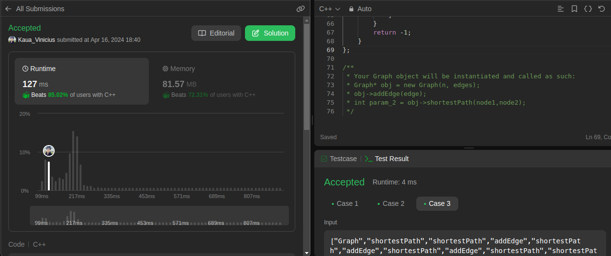

# Grafos2_JuizVirtual

**Número da Lista**: 2<br>
**Conteúdo da Disciplina**: Grafos2<br>

## Alunos

|Matrícula | Aluno |
| -- | -- |
| 21/1029399  |  Kauã Vinícius |
| 18/0030736  |  Carla de Araújo|

## Sobre 
Este repositório tem como objetivo a realização de exercícios de grafos do site [leetcode](https://leetcode.com/), seguem os exercícios solucionados com seus respectivos vídeos:

1 - [Design Graph With Shortest Path Calculator](https://leetcode.com/problems/design-graph-with-shortest-path-calculator/description/): Hard. [Vídeo]()
</br>
2 - [Min Cost to Connect All Points](https://leetcode.com/problems/min-cost-to-connect-all-points/description/): Medium. [Vídeo]()
</br>
3 - [](): Medium. [Vídeo]()
</br>
4 - [](): Medium. [Vídeo]()

## Screenshots
As imagens 1 à 4 evidenciam as screenshots dos códigos que foram aceitos pelo site:

##### 1 - Design Graph With Shortest Path Calculator


<div style="text-align: center">
<p> Imagem 1: Código aceito primeiro exercício (Fonte: Autor, 2024).</p>
</div>

##### 2 - Min Cost to Connect All Points


<div style="text-align: center">
<p> Imagem 2: Código aceito segundo exercício (Fonte: Autor, 2024).</p>
</div>

##### 3 - 


<div style="text-align: center">
<p> Imagem 3: Código aceito segundo exercício (Fonte: Autor, 2024).</p>
</div>

##### 4 - 


<div style="text-align: center">
<p> Imagem 4: Código aceito segundo exercício (Fonte: Autor, 2024).</p>
</div>

## Instalação 
**Linguagem**: C++ e Python<br>

Para os códigos python, execute:

```
python <nome do arquivo>
```

Para os códigos em c++, execute:

```
g++ -o <nomedoarquivo>.exe ./<nomedoarquivo>.cpp
```

